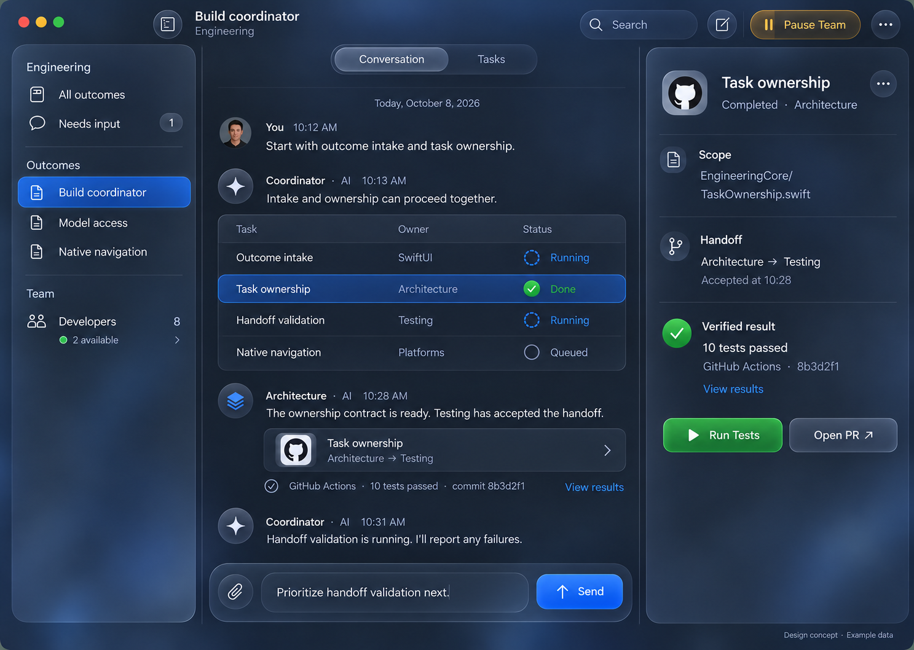

# Engineering Studio design direction

The approved workspace concept is the visual reference for the native app:

This image is a design concept with example data, not a running application.

## Structure

- Use a native three-column `NavigationSplitView`: outcomes, conversation/tasks, selected task details. Keep the selected outcome and task stable while resizing; adapt to a navigation stack on compact devices.
- Let the content background continue beneath the native unified toolbar. Place controls in the system's rounded toolbar groups; avoid a separate, contrasting header panel.
- Keep task inspection in the third column. Use native sheets for bounded flows such as creating an outcome or editing settings.
- Preserve a persistent composer for the selected outcome. Follow-up messages belong to that outcome and inform its next plan.

## Materials and actions

- Use standard materials for content structure and Liquid Glass for interactive surfaces such as the composer and primary actions.
- Choose materials for their semantic role. Let the system respond to window activity, wallpaper, Increase Contrast and Reduce Transparency; do not bake the concept's apparent glass color into images.
- Use blue for Send, green for Run/Prepare, and amber for Pause/Cancel. Keep labels and SF Symbols so color is supplementary.
- Keep typography native, content selectable, column sizes flexible and secondary text legible. Use system controls and keyboard commands.

## Truthful states

The reference depicts running developers, successful tests and an existing pull request. Those states require real evidence. Until connected execution exists, show planned tasks, zero connected developers, and unavailable test/PR controls with explanations. Never populate the production workspace with the concept's example activity.

## Implementation and evidence

The app implementation lives in `Apps/EngineeringStudio`, coordination logic in `Packages/EngineeringCore`, and disposable native capture infrastructure in `Tools/SwiftUIPreview`. All implementation code is Swift.

[Native screenshots](../Previews/README.md) show the actual views with isolated preview data. [Design QA](../../design-qa.md) records the comparison and outstanding validation. A preview build does not establish that the complete SDK 27 application or external services are ready.
