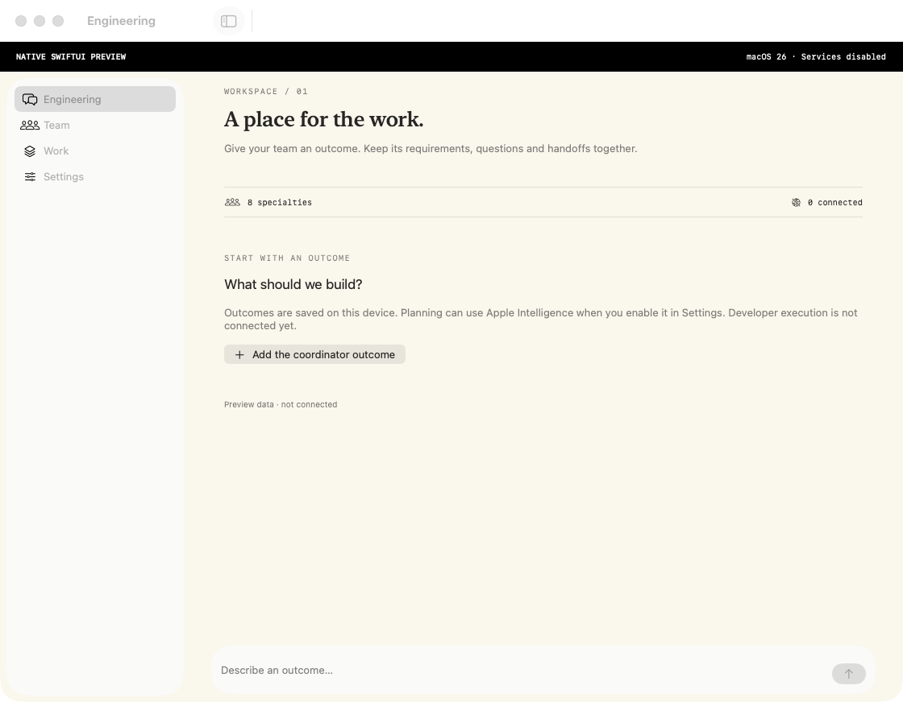
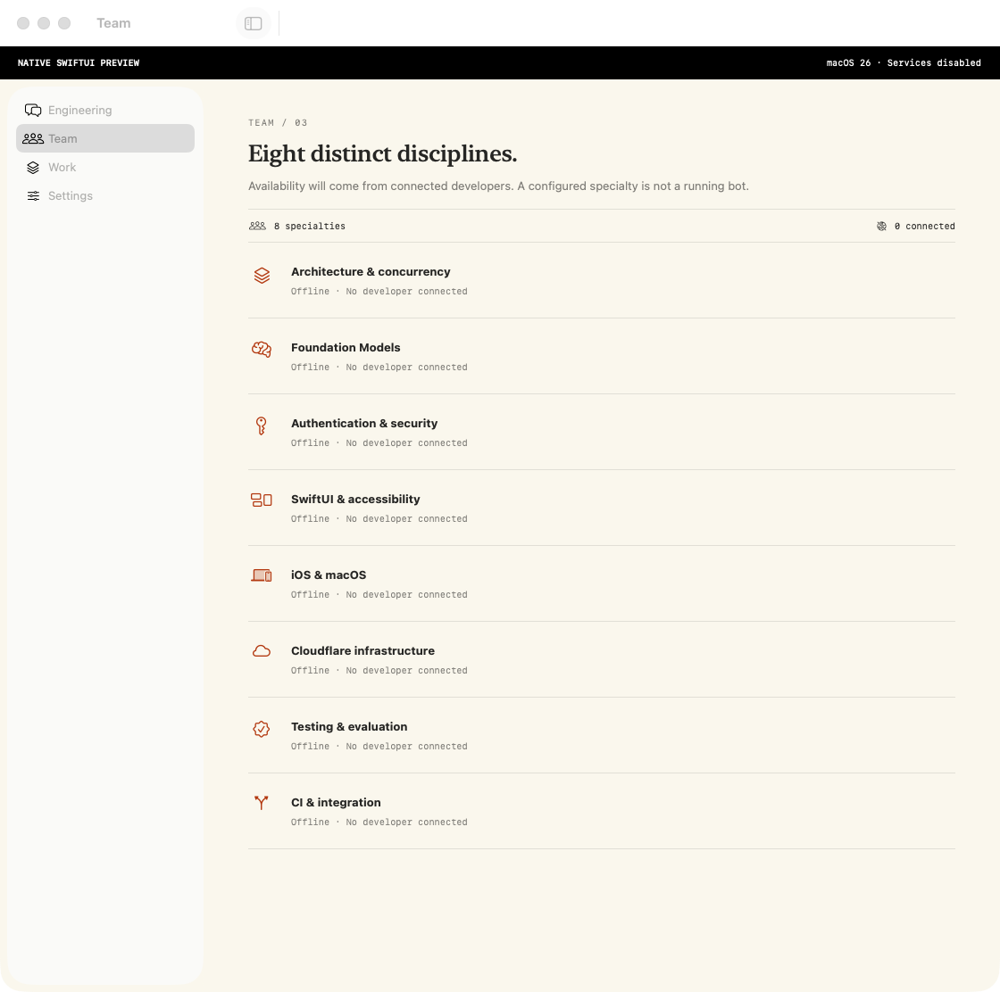
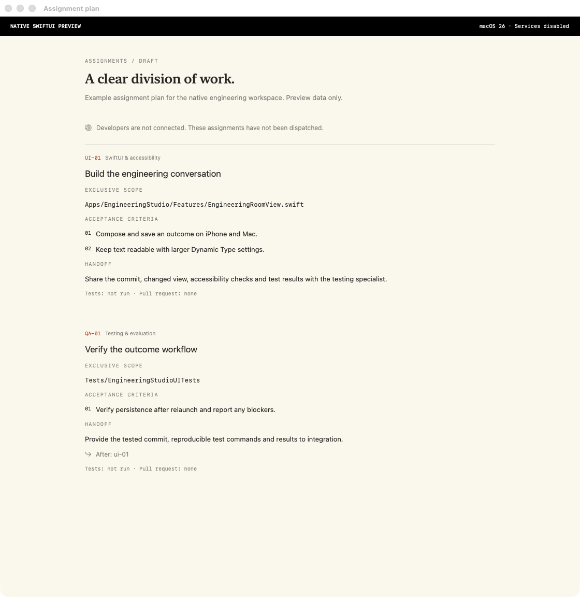

# Native SwiftUI screen captures

Captured from the actual SwiftUI views in commit `42dd755e88b7e2176628a4641473d9b1f19373df` using the isolated Swift preview host on macOS 26. These are screenshots of native windows, with in-memory preview state and services disabled. The assignment plan is explicitly sample data. They are not evidence that the complete iOS/macOS 27 app compiles or that developers are running.

[Successful capture run](https://github.com/kmshdev/foundation-models-utilities/actions/runs/37731119489)

## Engineering

## Team

## Example assignment plan

