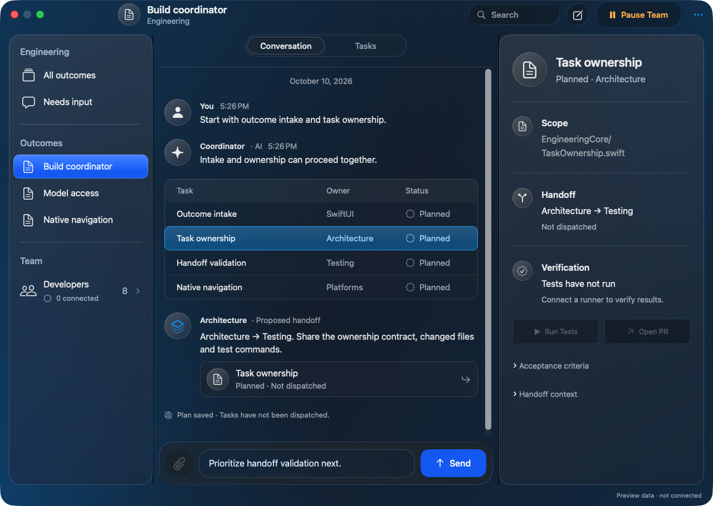
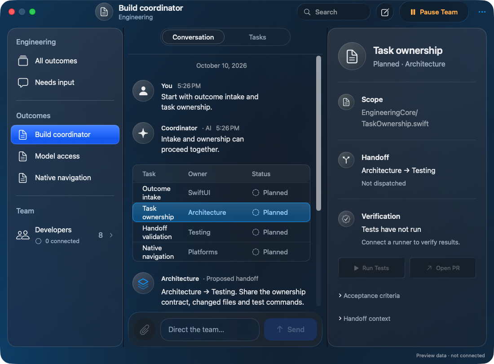
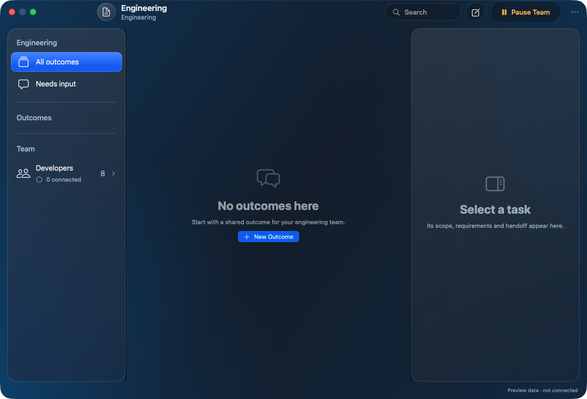
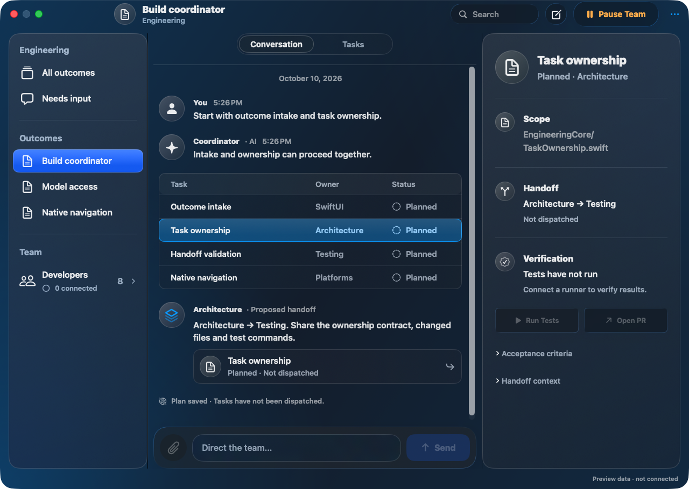

# Native SwiftUI screen captures

Captured from the actual SwiftUI views at `e62ed0e`, on macOS 26.6.2, with in-memory preview data and services disabled. These are foreground native windows, not generated mockups. Reduce Transparency was off; normal captures explicitly use regular text legibility, and the last capture uses increased-contrast appearance with bold text. Production respects the user’s display settings. No tasks were dispatched and no test or pull request evidence was fabricated.

[Successful capture and shared-iOS-view typecheck](https://github.com/kmshdev/foundation-models-utilities/actions/runs/38071723190). The isolated preview uses the installed SDK 26 toolchain and substitutes a disabled model service. It does not establish a successful production Swift 6.4 / SDK 27 build. See [design QA](../../design-qa.md).

## Selected outcome and task — 1280 × 910 pixels

## Narrower Mac window — 1100 × 810 pixels

## Empty workspace — 1280 × 872 pixels

## Increased-contrast appearance — 1280 × 910 pixels

